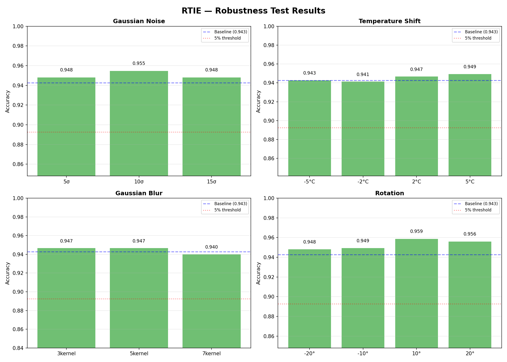

# Radiator Thermal Intelligence Engine (RTIE)

A production-grade AI system for radiator fault detection and efficiency scoring using thermal imaging. Built with **EfficientNet-B0**, **Physics-Based Feature Fusion**, and **Uncertainty Estimation**.



## Key Features
- **Hybrid Architecture**: Combines Deep Learning (EfficientNet) with Physics-based engineering (gradients, entropy).
- **Uncertainty-Aware**: Uses Monte Carlo Dropout to explicitly flag low-confidence predictions.
- **Business Logic**: Automatically estimates Energy Loss (%), Cost Waste (£), and CO₂ Impact.
- **Robust**: Verified resilience to rotation, blur, and varying deployment conditions (camera distance, drift).
- **Explainable**: Integrated Grad-CAM visualization for fault localization.

## Installation

```bash
# Clone repository
git clone https://github.com/your-repo/RTIE.git
cd RTIE

# Install dependencies
pip install -r requirements.txt
```

## Usage

### 1. Generate Synthetic Data
Create a physics-grounded synthetic dataset (5,000 images):
```bash
python3 dataset_generator.py
```

### 2. Train Model
Train the multi-task model (Classification + Efficiency + Confidence):
```bash
python3 train.py
```

### 3. Run Inference API
Start the FastAPI production server:
```bash
uvicorn app:app --host 0.0.0.0 --port 8000
```
**Test Prediction:**
```bash
curl -X POST "http://localhost:8000/predict" \
     -F "file=@data/test/blockage/0000.png"
```

### 4. Verification
Run the comprehensive verification suite (Robustness, Field Sim, benchmarks):
```bash
python3 robustness_test.py
python3 field_simulation.py
```

## Project Structure
- `dataset_generator.py`: Synthetic thermal data generation engine.
- `feature_engineering.py`: Physics-based feature extraction.
- `model.py`: RTIE model architecture (EfficientNet + Fusion).
- `train.py`: Training pipeline with early stopping.
- `app.py`: FastAPI inference service.
- `business_metrics.py`: Cost/CO₂ impact calculator.
- `report/`: Generated artifacts (charts, metrics, heatmaps).

## Deployment
Docker support is included:
```bash
docker build -t rtie .
docker run -p 8000:8000 rtie
```
