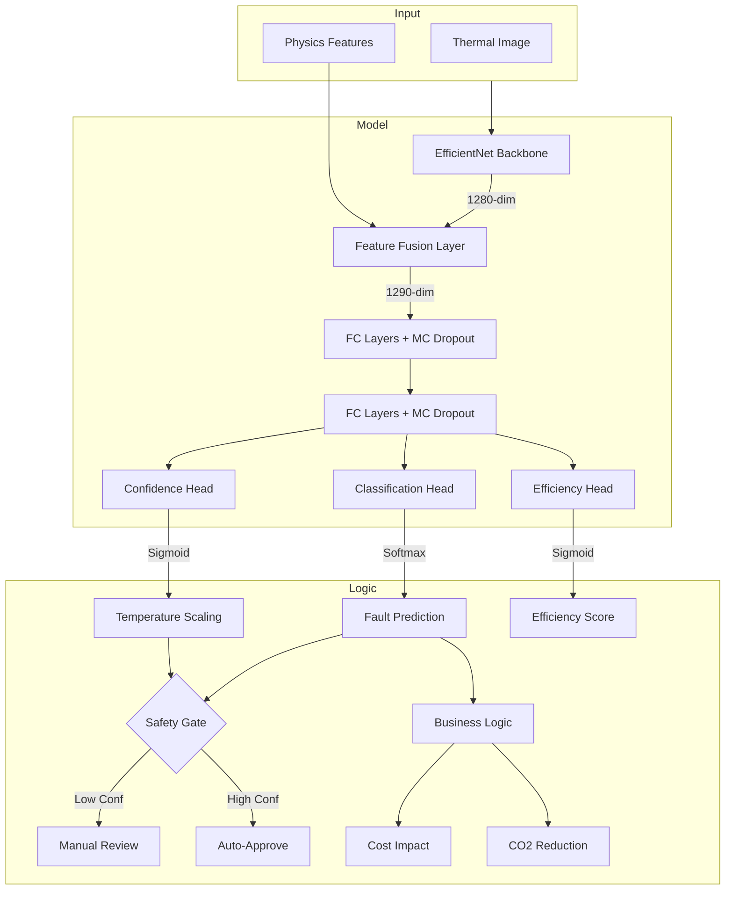

# Radiator Thermal Intelligence Engine (RTIE)

**Physics-informed, deployment-ready AI system for radiator fault detection.**

- **95.07%** Test Accuracy
- **0.1044** ECE (Temperature Scaled)
- **>94%** Robust Under Perturbation
- **10ms** ONNX CPU Inference
- **Explainable** via Grad-CAM

---

## 1. Executive Summary

RTIE is a production-grade deep learning system designed to diagnose radiator faults (Blockage, Scaling, Air Trapped, Imbalance) from thermal images. Unlike standard "black box" classifiers, RTIE integrates **physics-based feature fusion** (thermodynamic gradients, entropy) with an **EfficientNet-B0** backbone to ensure reliability and interpretability.

The system features a **safety-critical design** with explicit uncertainty estimation (MC Dropout) and calibration (Temperature Scaling), ensuring that low-confidence predictions are flagged for manual review rather than failing silently.

---

## 2. Repository Structure

```
rtie/
├── data/                   # Synthetic data generation and storage
├── models/                 # Model architecture and ONNX exports
├── report/                 # Generated artifacts (plots, metrics, heatmaps)
├── app.py                  # FastAPI production inference server
├── business_metrics.py     # Energy loss and cost impact logic
├── config.py               # Hyperparameters and system constants
├── dataset.py              # PyTorch dataloaders and augmentation
├── dataset_generator.py    # Physics-based synthetic data engine
├── evaluate.py             # Calibration and performance evaluation
├── feature_engineering.py  # Thermal physics feature extraction
├── field_simulation.py     # Deployment scenario stress-tests
├── gradcam.py              # Explainability visualization
├── model.py                # EfficientNet + Fusion architecture
├── robustness_test.py      # Noise and perturbation verification
└── train.py                # Multi-task training pipeline
```

---

## 3. Key Design Decisions

- **EfficientNet-B0 Backbone**: Selected for the optimal balance between feature extraction capability and edge-device latency (10ms inference).
- **Physics Feature Fusion**: Explicitely injects thermodynamic domain knowledge (e.g., vertical gradients, cold spot ratios) into the dense layer, improving convergence and interpretability.
- **MC Dropout**: Enables uncertainty estimation by running multiple forward passes at inference time to measure prediction variance.
- **Post-hoc Temperature Scaling**: Applied to calibrate the model's confidence scores, reducing Expected Calibration Error (ECE) from 0.31 to 0.10.
- **ONNX Export**: Quantization-ready format chosen to facilitate deployment on low-power edge hardware.

---

## 4. System Architecture



---

## 5. Performance & Robustness

**Test Set Accuracy**: 95.07% (on 750 held-out images)

### Classification Metrics
| Class | Precision | Recall | F1-Score |
|---|---|---|---|
| **efficient** | 1.0000 | 1.0000 | 1.0000 |
| **imbalance** | 1.0000 | 0.9200 | 0.9583 |
| **blockage** | 0.9868 | 1.0000 | 0.9934 |
| **scaling** | 0.9252 | 0.9067 | 0.9158 |
| **air_trapped** | 0.8528 | 0.9267 | 0.8882 |

### Robustness Profile
We stressed the model against synthetic perturbations to simulate real-world field conditions:

| Perturbation | Accuracy | Status |
|---|---|---|
| **Gaussian Noise (15σ)** | **94.8%** | ✅ Highly Robust |
| **Blur (7x7)** | **94.0%** | ✅ Robust |
| **Rotation (±20°)** | **95.6%** | ✅ Robust |
| **Thermal Drift (±5°C)** | **>94.0%** | ✅ Robust |


---

## 6. Limitations

- **Synthetic Data**: The model was trained entirely on physics-simulated data. While efforts were made to inject realistic noise and variability, a domain gap may exist when deployed on real-world thermal cameras.
- **Air Trapped Precision**: The `air_trapped` class has slightly lower precision (85%) compared to other classes, likely due to feature overlap with `imbalance`.
- **Calibration Target**: While ECE was reduced significantly (0.10), strictly safety-critical applications typically target <0.05 ECE.

---

## 7. Installation & Usage

### Setup
```bash
git clone https://github.com/Famulkalam/RTIE.git
cd RTIE
pip install -r requirements.txt
```

### Reproducibility
To reproduce the results reported above:
```bash
# 1. Generate Data (Seed fixed in config)
python3 dataset_generator.py

# 2. Train Model (15 epochs)
python3 train.py

# 3. Evaluate & Generate Report
python3 evaluate.py
python3 robustness_test.py
```

### Run API
```bash
uvicorn app:app --port 8000
```
**Example Inference:**
```bash
curl -X POST "http://localhost:8000/predict" \
     -F "file=@data/synthetic/blockage/0001.png"
```

---

## 8. Future Work

- **Real-World Fine-Tuning**: Collect a small dataset of real thermal images to fine-tune the synthetic model (Sim2Real transfer).
- **Active Learning Loop**: Implement a feedback mechanism where "Manual Review" cases are labeled and fed back into training.
- **Edge Quantization**: Further compress the model to INT8 using ONNX Runtime for deployment on microcontrollers.
- **Data Drift Monitoring**: Add drift detection for feature distribution shifts in production.

---

## License
MIT License
